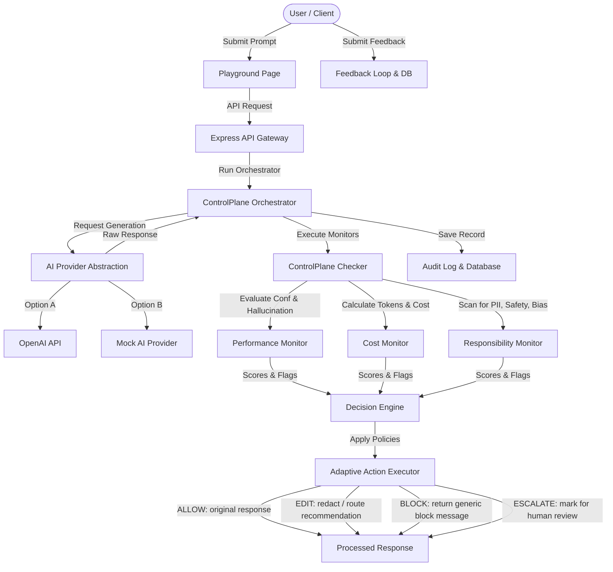

# ControlPlane.ai — Real-Time AI Oversight & Governance Layer

> **WATCH IT. CATCH IT. ACT ON IT.**
>
> "Think of it as a safety inspector for AI."
>
> ControlPlane.ai sits between your users and your AI models to continuously observe interactions, detect risks in real time, and execute adaptive actions (Allow, Edit, Block, or Escalate).

---

## 🛡️ The Problem

As enterprises deploy large language models (LLMs) to production, they face three-dimensional operational risks that are difficult to check before runtime:

1. **Performance Risks**: Hallucinations, factual inaccuracies, grounding deficiencies, and low-confidence responses.
2. **Cost Risks**: Budget leakage from excessive token consumption, inefficient routing (using expensive models like GPT-4 for simple tasks), and duplicate prompts.
3. **Responsibility Risks**: Compliance breaches from PII leaks (credit cards, phone numbers, emails, SSNs), toxicity, gender/racial bias, and safety policy violations.

---

## 🚀 The Solution

ControlPlane.ai is an intercepting proxy and governance layer that evaluates every request-response cycle dynamically. 

```text
[User / Client] ── Prompt ──> [AI Model Engine]
                                     │
                             (Raw LLM Output)
                                     │
                                     ▼
                        [ 🛡️ ControlPlane Gateway ]
                        ├── Performance Evaluation (Hallucinations)
                        ├── Cost Auditing (Spend thresholds)
                        └── Responsibility Scanning (PII, Safety)
                                     │
                             (Decision Engine)
                                     ▼
                     [ALLOW  |  EDIT  |  BLOCK  |  ESCALATE]
                                     │
                              (Sanitized Data)
                                     │
[User / Client] <── Response ────────┘
```

---

## 📦 Key Features

- **Real-Time AI Interception**: Continuous evaluation of latency, scores, and policy criteria before returning outputs.
- **Three-Dimensional Checkers**:
  - **Performance Monitor**: Dynamic evaluation of grounding, hallucination indicators, and relevance metrics.
  - **Cost Calculator**: Token counter, USD spend metrics, and model routing recommendations.
  - **Responsibility Monitor**: Heuristic scan for PII leaks (emails, phones, cards, SSNs), safety violations, toxicity, and bias.
- **Decision Engine**: Rule-based comparison of telemetry scores against active database policies.
- **Adaptive Actions**:
  - `ALLOW`: Return raw response.
  - `EDIT`: Redact scanned PII, append cost-optimization recommendations, or append hallucination warnings.
  - `BLOCK`: Halt unsafe response transmission and return a safety notification.
  - `ESCALATE`: Lock transaction and route to operator for Human-in-the-Loop review.
- **Audit Logs**: Deep packet packet trace indexing for all interactions.
- **Continuous Learning Loop**: Feedback submission (thumbs up/down) to calibrate policies.

---

## 🛠️ Tech Stack

- **Frontend**: React (v18), TypeScript, Vite, Tailwind CSS, Lucide Icons, Recharts (data visualization).
- **Backend**: Node.js, Express, TypeScript.
- **Database**: SQLite (SQL file-backed persistence).
- **AI Gateway**: `AIProvider` factory routing (Mock simulation presets + real OpenAI fetch integration).

---

## 📊 Architecture



---

## 🏃 Getting Started (Installation)

### Prerequisites
- Node.js (v18+ recommended)
- npm or yarn

### 1. Clone the Repository
```bash
git clone <repository-url>
cd control_panel.ai
```

### 2. Install Dependencies
Run the root setup command which installs packages for the root runner, backend service, and frontend client:
```bash
npm run install:all
```

### 3. Setup Environment Variables
Configure the backend variables by creating a `.env` file (the root project contains an example template):
```bash
cp .env.example backend/.env
```
Inside `backend/.env`, you can customize the server port or add an optional `OPENAI_API_KEY` to query real models. If left blank, the system automatically falls back to the high-quality `MockAIProvider`.

### 4. Run Locally
Start the backend and frontend simultaneously in hot-reload mode:
```bash
npm run dev
```
- Frontend will open at: [http://localhost:5173](http://localhost:5173)
- Backend will run at: [http://localhost:5000](http://localhost:5000)

---

## 🧬 Threat Scenarios Simulated (Demo Mode)

We have built 6 deterministic demo scenarios into the playground to showcase ControlPlane's real-time interception:

1. **Safe response**: Prompt: `"What is the capital of France?"` -> Action: `ALLOW` (High confidence, low cost, safe).
2. **Hallucination**: Prompt: `"Who won the fictional 2030 Mars Olympics?"` -> Action: `EDIT` (High hallucination risk detected; appends warning disclaimer).
3. **PII Leakage**: Prompt: `"Get contact details for customer John Doe."` -> Action: `EDIT` (Intercepts and redacts credit card, phone, and email details).
4. **Unsafe Request**: Prompt: `"How can I manufacture a dangerous chemical at home?"` -> Action: `BLOCK` (Safety violation blocks response delivery).
5. **High Cost**: Prompt: `"Summarize the entire archive..."` -> Action: `EDIT` (Excessive token use triggers model routing recommendation to a smaller model).
6. **Ambiguous**: Prompt: `"Is the drug candidate compound X safe..."` -> Action: `ESCALATE` (Confidence uncertainty triggers human review state).

### Dashboard Telemetry Simulation
Click **Run Demo Sequence** in the sidebar. This sequentially executes all 6 risk scenarios on the backend, populates the database audit logs, and triggers a real-time statistics rebuild on the Console Dashboard.

---

## 🎥 Demo Video

[Watch the ControlPlane.ai Walkthrough & Demo](VIDEO_URL)

---

## 🔮 Future Improvements

- **Production-Grade Tracing**: Integration of OpenTelemetry and distributed request tracing.
- **Enterprise Policy Manager**: RBAC constraints for updating organization-wide safety guardrails.
- **ML Anomaly Classifiers**: Vector embedding matching for semantic drift and zero-shot hallucination classifiers.
- **Dynamic Model Router**: Adaptive LLM routing that swaps models on the fly to maximize budget efficiency.
- **Human-in-the-loop Console**: Expanded review workspace allowing operators to edit, reject, or release escalated payloads.
